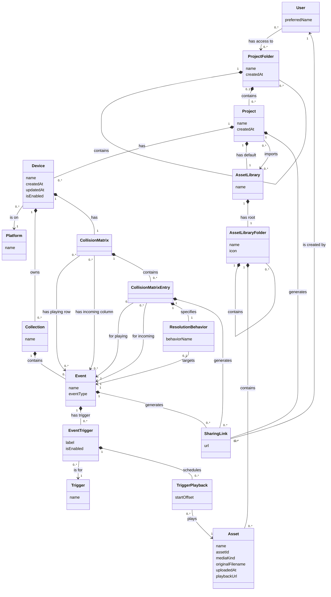

# Vibra domain model

Single source of truth for the Vibra conceptual domain model. Agent instructions live in [`MODEL_PROMPT.md`](MODEL_PROMPT.md); this file is what the agent edits.

---

## Prescriptions

Domain-modeling sentences go here. Write business rules in plain language; the agent translates them into diagram updates.

- Each user upon signing in will see a "Projects" view of project folders that may contain other project folders and Projects.
- Folders can be shared with other users.
- A ProjectFolder may contain both child ProjectFolders and Projects.
- A Project may belong to a ProjectFolder or sit at the root of the Projects view.
- Folders and Projects should have creation date timestamps.
- A Project configures zero or more Devices (e.g. iPhone 16 Pro, iPhone 16e) on Platforms (iOS, Android, etc.). Each Device owns that Project's Collections and CollisionMatrix for that target. Collections are groups of Events and cannot contain other Collections.
- An Event is generically a "sound trigger": one or more sounds or haptic files scheduled to play in a certain order when the user takes a specific action.
- An Event has zero or more Triggers drawn from the fixed set { onHover, onPress, onRelease, onHold } (replacing a single event type).
- For each Trigger on an Event, the designer may schedule one or more media playbacks (audio, haptic, or both), each with a `startOffset` in seconds relative to when that Trigger fires (e.g. haptic at 0.3s while audio starts at 0s).
- An AssetLibrary consists of uploaded Assets, exists independently of Projects, and can be imported into a Project by linking it.
- Each Project has exactly one default AssetLibrary, created when the Project is created. Other AssetLibraries can be created independently, filled with Assets, and imported into a Project—including another Project's default library.
- An Event has an eventType drawn from the fixed set { Button, Toggle, Banner, Toast }.
- An AssetLibrary contains exactly one top-level folder by default; folders may nest arbitrarily and may contain both child folders and Asset files (audio and haptic).
- An AssetLibraryFolder has a name and an icon used for display.
- An AssetLibrary has a name.
- Collections, Projects, and ProjectFolders have names.
- Events have names.
- A User has a preferred name.
- Assets have names.
- Assets have an original filename and upload date.
- An Asset has a playback URL.
- Each Device has a CollisionMatrix.
- A Device can own zero or more Collections.
- Platform is a catalog concept with a `name` drawn from { iOS, Windows, Mac, Linux, Android }.
- Within a Device, Events can overlap when playback collides. Its CollisionMatrix lets the designer specify what happens when two Events overlap. Each pairing uses a ResolutionBehavior with `behaviorName` from { Preempt, Queue, Co-play, Suppress, Not possible }; when a behavior affects one side, `target` is the Event being affected (the playing or incoming Event). A new matrix is empty; the designer selects Events from that Device's Collections as playing rows and incoming columns, then sets a ResolutionBehavior for each row–column pairing.
- An Event can be shared by generating one or more SharingLinks.
- SharingLinks can be created for a Project, an individual Event, or a specific CollisionMatrixEntry (two Events in a CollisionMatrix), for playback in a mobile app.
- A SharingLink has a `url` and is created by exactly one User.
- A Device has `name`, `createdAt`, `updatedAt`, and `isEnabled` (whether this device target is active for export and playback).
- An EventTrigger has an optional `label`, and `isEnabled` (whether this trigger binding fires its playbacks).

---

## Concepts

| Concept | Attributes | Notes |
|---|---|---|
| User | preferredName | Signs in; the Projects view shows folders shared with them. |
| ProjectFolder | name, createdAt | A node in the folder hierarchy; may contain child folders and Projects. |
| Project | name, createdAt | Content inside a ProjectFolder or at the Projects root. |
| Platform | name | Platform catalog entry; `name` is iOS, Windows, Mac, Linux, or Android. |
| Device | name, createdAt, updatedAt, isEnabled | A named target on a Platform within a Project; owns Collections and a CollisionMatrix. |
| CollisionMatrix | | Resolves playback collisions between Events in one Device; initially empty. |
| CollisionMatrixEntry | | One row–column pairing: a playing Event, an incoming Event, and a ResolutionBehavior. |
| ResolutionBehavior | behaviorName | How overlap is resolved; may target the playing or incoming Event of the entry. |
| Collection | name | A flat group of Events in one Device; does not nest other Collections. |
| Event | name, eventType | A sound trigger for a UI component kind; fires linked assets when its Triggers activate. |
| Trigger | name | A user-interaction hook; one of onHover, onPress, onRelease, onHold. |
| EventTrigger | label, isEnabled | One Trigger on an Event with scheduled media playbacks; `label` is an optional designer note. |
| TriggerPlayback | startOffset | One Asset scheduled at an offset when the parent EventTrigger fires. |
| SharingLink | url | A generated link for mobile-app playback of a Project, Event, or CollisionMatrixEntry; `url` is the shareable address. |
| AssetLibrary | name | Catalog of Assets organized in folders; may be a Project's default, standalone, or imported. |
| AssetLibraryFolder | name, icon | A node in a library folder tree; icon is used for display. |
| Asset | name, assetId, mediaKind, originalFilename, uploadedAt, playbackUrl | Uploaded audio or haptic file in an AssetLibraryFolder; mediaKind is audio or haptic. |

---

## Relationships

| From | Label (reads →) | To | Multiplicity (from → to) | Multiplicity (to → from) | Kind |
|---|---|---|---|---|---|
| User | has access to | ProjectFolder | 0..* | 0..* | Association |
| ProjectFolder | contains | ProjectFolder | 0..* | 1 | Composition |
| ProjectFolder | contains | Project | 0..* | 0..1 | Composition |
| Project | has | Device | 0..* | 1 | Composition |
| Device | is on | Platform | 1 | 0..* | Association |
| Device | owns | Collection | 0..* | 1 | Composition |
| Device | has | CollisionMatrix | 1 | 1 | Composition |
| CollisionMatrix | has playing row | Event | 0..* | 0..* | Association |
| CollisionMatrix | has incoming column | Event | 0..* | 0..* | Association |
| CollisionMatrix | contains | CollisionMatrixEntry | 0..* | 1 | Composition |
| CollisionMatrixEntry | for playing | Event | 1 | 0..* | Association |
| CollisionMatrixEntry | for incoming | Event | 1 | 0..* | Association |
| CollisionMatrixEntry | specifies | ResolutionBehavior | 1 | 1 | Composition |
| CollisionMatrixEntry | generates | SharingLink | 0..* | 1 | Composition |
| ResolutionBehavior | targets | Event | 0..1 | 0..* | Association |
| Collection | contains | Event | 0..* | 1 | Composition |
| Event | has trigger | EventTrigger | 0..* | 1 | Composition |
| Project | generates | SharingLink | 0..* | 1 | Composition |
| Event | generates | SharingLink | 0..* | 1 | Composition |
| SharingLink | is created by | User | 1 | 0..* | Association |
| EventTrigger | is for | Trigger | 1 | 0..* | Association |
| EventTrigger | schedules | TriggerPlayback | 0..* | 1 | Composition |
| TriggerPlayback | plays | Asset | 1 | 0..* | Association |
| Project | has default | AssetLibrary | 1 | 0..1 | Composition |
| Project | imports | AssetLibrary | 0..* | 0..* | Association |
| AssetLibrary | has root | AssetLibraryFolder | 1 | 1 | Composition |
| AssetLibraryFolder | contains | AssetLibraryFolder | 0..* | 1 | Composition |
| AssetLibraryFolder | contains | Asset | 0..* | 1 | Composition |

**Readable sentences**

- **User → ProjectFolder (`has access to`):** A User has access to zero or more ProjectFolders; a ProjectFolder is shared with zero or more Users.
- **ProjectFolder → ProjectFolder (`contains`):** A ProjectFolder contains zero or more child ProjectFolders; a child ProjectFolder is contained in exactly one parent ProjectFolder.
- **ProjectFolder → Project (`contains`):** A ProjectFolder contains zero or more Projects; a Project belongs to zero or one ProjectFolder. A Project with no ProjectFolder is a root-level Project in the Projects view.
- **Project → Device (`has`):** A Project has zero or more Devices; a Device belongs to exactly one Project.
- **Device → Platform (`is on`):** A Device is on exactly one Platform; a Platform has zero or more Devices configured across Projects.
- **Device → Collection (`owns`):** A Device owns zero or more Collections; a Collection belongs to exactly one Device.
- **Device → CollisionMatrix (`has`):** A Device has exactly one CollisionMatrix; a CollisionMatrix belongs to exactly one Device.
- **CollisionMatrix → Event (`has playing row`):** A CollisionMatrix has zero or more playing-row Events; an Event appears as a playing row on zero or more CollisionMatrices.
- **CollisionMatrix → Event (`has incoming column`):** A CollisionMatrix has zero or more incoming-column Events; an Event appears as an incoming column on zero or more CollisionMatrices.
- **CollisionMatrix → CollisionMatrixEntry (`contains`):** A CollisionMatrix contains zero or more CollisionMatrixEntries; a CollisionMatrixEntry belongs to exactly one CollisionMatrix.
- **CollisionMatrixEntry → Event (`for playing`):** A CollisionMatrixEntry is for exactly one playing Event; an Event is the playing side of zero or more CollisionMatrixEntries.
- **CollisionMatrixEntry → Event (`for incoming`):** A CollisionMatrixEntry is for exactly one incoming Event; an Event is the incoming side of zero or more CollisionMatrixEntries.
- **CollisionMatrixEntry → ResolutionBehavior (`specifies`):** A CollisionMatrixEntry specifies exactly one ResolutionBehavior; a ResolutionBehavior belongs to exactly one CollisionMatrixEntry.
- **CollisionMatrixEntry → SharingLink (`generates`):** A CollisionMatrixEntry generates zero or more SharingLinks; a SharingLink belongs to exactly one Project, Event, or CollisionMatrixEntry.
- **ResolutionBehavior → Event (`targets`):** A ResolutionBehavior targets zero or one Event; an Event is targeted by zero or more ResolutionBehaviors.
- **Collection → Event (`contains`):** A Collection contains zero or more Events; an Event belongs to exactly one Collection.
- **Event → EventTrigger (`has trigger`):** An Event has zero or more EventTriggers; an EventTrigger belongs to exactly one Event.
- **Event → SharingLink (`generates`):** An Event generates zero or more SharingLinks; a SharingLink belongs to exactly one Project, Event, or CollisionMatrixEntry.
- **SharingLink → User (`is created by`):** A SharingLink is created by exactly one User; a User creates zero or more SharingLinks.
- **EventTrigger → Trigger (`is for`):** An EventTrigger is for exactly one Trigger; a Trigger is used by zero or more EventTriggers.
- **EventTrigger → TriggerPlayback (`schedules`):** An EventTrigger schedules zero or more TriggerPlaybacks; a TriggerPlayback belongs to exactly one EventTrigger.
- **TriggerPlayback → Asset (`plays`):** A TriggerPlayback plays exactly one Asset; an Asset is played by zero or more TriggerPlaybacks.
- **Project → SharingLink (`generates`):** A Project generates zero or more SharingLinks; a SharingLink belongs to exactly one Project, Event, or CollisionMatrixEntry.
- **Project → AssetLibrary (`has default`):** A Project has exactly one default AssetLibrary; an AssetLibrary is the default for at most one Project.
- **Project → AssetLibrary (`imports`):** A Project imports zero or more AssetLibraries; an AssetLibrary is imported by zero or more Projects.
- **AssetLibrary → AssetLibraryFolder (`has root`):** An AssetLibrary has exactly one root AssetLibraryFolder; a root AssetLibraryFolder belongs to exactly one AssetLibrary.
- **AssetLibraryFolder → AssetLibraryFolder (`contains`):** An AssetLibraryFolder contains zero or more child AssetLibraryFolders; a child AssetLibraryFolder is contained in exactly one parent AssetLibraryFolder.
- **AssetLibraryFolder → Asset (`contains`):** An AssetLibraryFolder contains zero or more Assets; an Asset belongs to exactly one AssetLibraryFolder.

---

## Diagram

---

## Constraints

Rules the diagram cannot express:

- The signed-in user's Projects view shows ProjectFolders shared with them and the nested folder tree beneath each accessible folder.
- A ProjectFolder may contain both child ProjectFolders and Projects.
- A newly created ProjectFolder may contain no Projects and no child ProjectFolders.
- A root-level Project has no containing ProjectFolder.
- Each Device for a Project is edited independently of the Project's other Devices.
- A Project has at most one Device per `name` on a given Platform.
- A disabled Device is excluded from export and mobile-app playback.
- Collections are flat: a Collection must not contain other Collections.
- A Platform's `name` must be one of: iOS, Windows, Mac, Linux, Android.
- Within a Device, a user may create unbounded Events; playback may overlap based on user actions.
- A CollisionMatrix is created when its Device is created.
- A new CollisionMatrix has no playing rows, incoming columns, or entries.
- Events listed on a CollisionMatrix must belong to Collections owned by that matrix's Device.
- A CollisionMatrixEntry's playing Event must be listed as a playing row; its incoming Event must be listed as an incoming column.
- A CollisionMatrix has at most one entry per playing–incoming Event pair.
- A ResolutionBehavior's `behaviorName` must be one of: Preempt, Queue, Co-play, Suppress, Not possible.
- A ResolutionBehavior's target Event must be the playing or incoming Event of its CollisionMatrixEntry.
- When `behaviorName` is Suppress, a target Event is required.
- When an Event is shared, at least one SharingLink is generated.
- When a Project is shared, at least one SharingLink is generated.
- When a CollisionMatrixEntry is shared, at least one SharingLink is generated.
- A SharingLink targets exactly one Project, exactly one Event, or exactly one CollisionMatrixEntry (not more than one); it is for playback in a mobile app.
- A SharingLink's `url` is assigned when the link is generated.
- A SharingLink's creating User is recorded at generation time (`is created by`).
- When an EventTrigger's Trigger fires, its TriggerPlaybacks play at their scheduled `startOffset`s (0 = immediately).
- An EventTrigger may schedule audio, haptic, or both via separate TriggerPlaybacks.
- A Trigger's `name` must be one of: onHover, onPress, onRelease, onHold.
- An Event has at most one EventTrigger per Trigger (no duplicate onPress on the same Event).
- A disabled EventTrigger does not fire its TriggerPlaybacks when its Trigger activates.
- An Event's `eventType` must be one of: Button, Toggle, Banner, Toast.
- An Asset's `mediaKind` must be audio or haptic.
- A default AssetLibrary is created when its Project is created, with one top-level root folder.
- An AssetLibraryFolder may contain both child AssetLibraryFolders and Assets.
- A newly created AssetLibraryFolder may contain no Assets and no child folders.
- A Project's default AssetLibrary is always available to that Project without being listed as an import.
- A Project must not import its own default AssetLibrary.
- A TriggerPlayback may only play an Asset from the Project (via Event → Collection → Device → Project) default AssetLibrary or an AssetLibrary imported by that Project.
- Deleting a ProjectFolder deletes its child ProjectFolders and Projects recursively.
- Deleting a Project deletes its Devices, CollisionMatrices, Collections, Events, default AssetLibrary, import links, and SharingLinks.
- Deleting a Device deletes its Collections, Events, and CollisionMatrix records.
- Deleting a Collection deletes its Events.
- Deleting an Event deletes its EventTriggers, TriggerPlaybacks, CollisionMatrix references, CollisionMatrixEntries that reference it, and SharingLinks.
- Deleting an AssetLibrary deletes its folder tree and Assets, except a Project default AssetLibrary is deleted only with its Project.
- Deleting an AssetLibraryFolder deletes child folders and Assets recursively.
- Deleting an Asset deletes its stored file data and TriggerPlaybacks that reference it.
- Deleting a CollisionMatrix row or column deletes entries that depend on that row or column.
- Deleting a CollisionMatrixEntry deletes SharingLinks generated for it.

---

## Open questions

Unresolved product decisions:

- What access levels exist when a folder is shared (e.g. view-only vs edit)?
- Who creates and owns a standalone AssetLibrary (User, team, global catalog)?
- Which `behaviorName` values besides Suppress require a target Event?
- Can a SharingLink's `url` be regenerated or revoked after it is created, and must it be unique across links?

---

## Change log

| Date | Change |
|---|---|
| 2026-07-26 | Added User, ProjectFolder, and Project with nested folder composition and leaf Projects; noted leaf-folder rule and open questions on sharing and empty folders. |
| 2026-07-26 | Replaced User–ProjectFolder ownership with many-to-many sharing (`has access to`); allowed empty leaf folders at creation; resolved sharing and empty-folder open questions. |
| 2026-07-26 | Added `createdAt` attribute to ProjectFolder and Project. |
| 2026-07-26 | Added Device and promoted DeviceConfiguration for per-platform independent project settings. |
| 2026-07-26 | Renamed DeviceSystem concept to Device. |
| 2026-07-26 | Added Collection and Event under Project; flat Collections (no nesting); Event as sound trigger with name, eventType, and asset ids. |
| 2026-07-26 | Replaced Event `eventType` with Trigger concept and many-to-many `has trigger`; fixed vocabulary onHover, onPress, onRelease, onHold. |
| 2026-07-26 | Promoted EventTrigger junction; each trigger links to one Asset (audio or haptic); removed asset ids from Event. |
| 2026-07-26 | Added AssetLibrary per Project; uploaded Assets composed into the library; EventTriggers must reference library Assets. |
| 2026-07-26 | Made AssetLibrary standalone; Project imports libraries via association (overrides prior 1:1 ownership). |
| 2026-07-26 | Added Project default AssetLibrary (1:1 composition, created with Project); imports cover standalone and other Projects' default libraries. |
| 2026-07-26 | Added Event `eventType` with fixed vocabulary Button, Toggle, Banner, Toast (distinct from interaction Triggers). |
| 2026-07-26 | Replaced flat AssetLibrary→Asset with nested AssetLibraryFolder tree; one root folder per library; Assets at folder leaves. |
| 2026-07-26 | Added `name` and `icon` attributes to AssetLibraryFolder. |
| 2026-07-26 | Added `name` attribute to AssetLibrary. |
| 2026-07-26 | Added `name` to Collection, Project, and ProjectFolder. |
| 2026-07-26 | Added User `preferredName` and Asset `name`. |
| 2026-07-26 | Added Asset `originalFilename` and `uploadedAt`. |
| 2026-07-26 | Renamed Device to DeviceSystem; added CollisionMatrix (1:1 per DeviceSystem). |
| 2026-07-26 | Added DeviceSystem `owns` Collection (0..*); each Collection belongs to one DeviceSystem and one Project. |
| 2026-07-26 | Removed DeviceConfiguration; Project `is configured for` DeviceSystem (M:N); removed Project→Collection. |
| 2026-07-26 | Added DeviceSystem `deviceSystem` attribute; fixed vocabulary iOS, Windows, Mac, Linux, Android (replaced `name`). |
| 2026-07-26 | Renamed DeviceSystem attribute `deviceSystem` to `platform`. |
| 2026-07-26 | Modeled CollisionMatrix rows/columns/entries and collision resolution behaviors Preempt, Queue, Co-play, Suppress, Not possible. |
| 2026-07-26 | Promoted ResolutionBehavior with `behavior` and optional `target` (playing or incoming); required for Suppress. |
| 2026-07-26 | Renamed `behavior` to `behaviorName`; `target` is now an association to Event (playing or incoming of the entry). |
| 2026-07-26 | Added Asset `playbackUrl`. |
| 2026-07-26 | Renamed InterruptionMatrix/InterruptionMatrixEntry to CollisionMatrix/CollisionMatrixEntry throughout. |
| 2026-07-26 | Added SharingLink; Event generates 0..* links (1+ when shared). |
| 2026-07-28 | Relaxed ProjectFolder containment so folders may contain both child folders and Projects; Projects may also sit at the Projects root. |
| 2026-07-28 | Relaxed AssetLibraryFolder containment so asset folders may contain both child folders and Assets. |
| 2026-07-28 | Added delete cascade constraints for folders, projects, devices, collections, events, assets, libraries, matrix entries, and sharing links. |
| 2026-07-26 | SharingLinks also generated by Project; each link targets Project or Event for mobile-app playback. |
| 2026-07-26 | SharingLinks can target a CollisionMatrixEntry (playing/incoming Event pair in a CollisionMatrix). |
| 2026-07-26 | Replaced EventTrigger→Asset with TriggerPlayback; supports audio/haptic/both per trigger with `startOffset`. |
| 2026-07-26 | Promoted ProjectPlatformConfig; Collections and CollisionMatrix scoped per Project per DeviceSystem (overrides global DeviceSystem ownership). |
| 2026-07-26 | Added ProjectPlatformConfig timestamps and `isEnabled`; EventTrigger optional `label` and `isEnabled`. |
| 2026-07-26 | Extracted Platform catalog; collapsed ProjectPlatformConfig and DeviceSystem into Device (named target on Platform, owns Collections and CollisionMatrix). |
| 2026-07-26 | Added SharingLink `url` attribute and `is created by` association to User (creator modeled as a relationship, not a bare field). |
